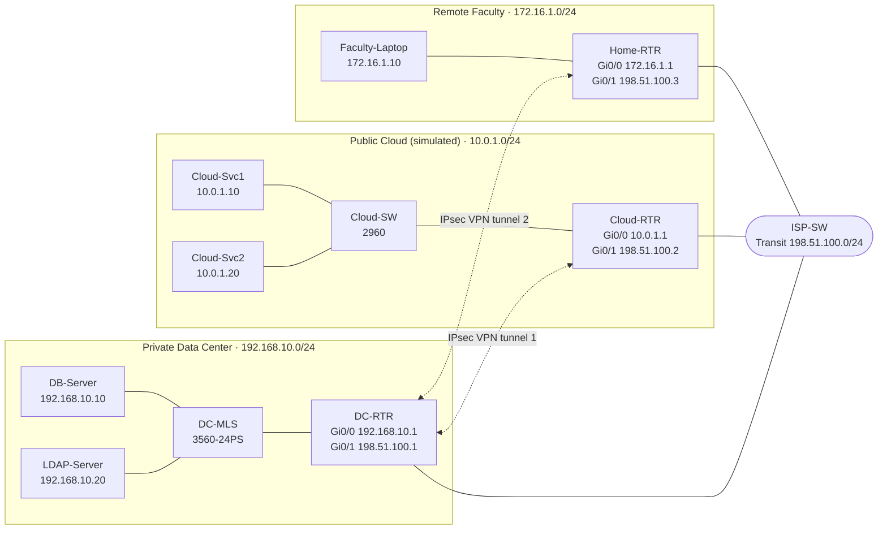

# Secure Hybrid Data Center Network

**Cisco Virtual Internship 2026 · Cyber Security Track**

A Cisco Packet Tracer lab that simulates a secure hybrid network: a private on-premises data center, a simulated public cloud running Kubernetes-style workloads, and remote faculty access. Traffic between sites is protected by IPsec VPN tunnels, and the data center perimeter is filtered by an extended ACL.

---

## Table of Contents

1. [Project Overview](#1-project-overview)
2. [Topology](#2-topology)
3. [Devices and IP Addressing](#3-devices-and-ip-addressing)
4. [Security Design](#4-security-design)
5. [ACL Rules](#5-acl-rules)
6. [VPN Configuration Summary](#6-vpn-configuration-summary)
7. [Verification](#7-verification)
8. [Known Limitations](#8-known-limitations)
9. [Production Recommendations](#9-production-recommendations)
10. [Repository Structure](#10-repository-structure)
11. [How to Open the Lab](#11-how-to-open-the-lab)

---

## 1. Project Overview

Most modern applications are hybrid: part of the workload runs in a private data center and part in a public cloud. Data must leave the data center to reach the cloud, so the connection needs strong encryption, segmentation, and access control.

This project designs and builds a small version of that environment and answers three questions from the problem statement:

- How should identity and access be controlled for admins, developers, and faculty?
- What filtering (security groups / ACLs) should sit between the zones?
- How can the zones be segmented so that an attack on one application cannot spread to the others or to the enterprise network?

**What was built in Packet Tracer**

| Zone | Purpose | Subnet |
|---|---|---|
| Private Data Center | Database and LDAP/authentication servers | `192.168.10.0/24` |
| Public Cloud (simulated) | Two servers standing in for Kubernetes / microservice nodes | `10.0.1.0/24` |
| Remote Faculty | Faculty laptop working from off campus | `172.16.1.0/24` |
| Transit ("Internet") | Shared link connecting the three routers | `198.51.100.0/24` |

---

## 2. Topology


*Screenshot of the working Packet Tracer topology (`topology/hybrid-datacenter.pkt`).*

### Architecture diagram



### Text version of the layout

```
 PRIVATE DATA CENTER                      TRANSIT                     PUBLIC CLOUD (simulated)
 192.168.10.0/24                       198.51.100.0/24                    10.0.1.0/24

 DB-Server ───┐                                                    ┌─── Cloud-Svc1
 LDAP-Server ─┴─ DC-MLS ── DC-RTR ═══╗                ╔═══ Cloud-RTR ── Cloud-SW ─┤
                                     ╠═══ ISP-SW ═════╣
                                     ║                ║                └─── Cloud-Svc2
                                  Home-RTR ───────────╝
                                     │
                              Faculty-Laptop
                              172.16.1.0/24
                              REMOTE FACULTY

 ═══  physical links       IPsec tunnels: DC-RTR ⇄ Cloud-RTR   and   DC-RTR ⇄ Home-RTR
```

---

## 3. Devices and IP Addressing

### Devices

| Device | Model / Type | Role |
|---|---|---|
| DC-RTR | Cisco 1941 router | Data center edge: VPN endpoint and ACL firewall |
| DC-MLS | Cisco 3560-24PS multilayer switch | Data center LAN switch |
| DB-Server | Server-PT | Database server |
| LDAP-Server | Server-PT | LDAP / authentication server |
| ISP-SW | Cisco 2960-24TT switch | Simulated internet / transit |
| Cloud-RTR | Cisco 1941 router | Cloud edge: VPN endpoint |
| Cloud-SW | Cisco 2960-24TT switch | Cloud LAN switch |
| Cloud-Svc1 | Server-PT | Simulated Kubernetes / microservice node |
| Cloud-Svc2 | Server-PT | Simulated Kubernetes / microservice node |
| Home-RTR | Cisco 1941 router | Faculty remote-site router and VPN endpoint |
| Faculty-Laptop | Laptop-PT | Faculty member working remotely |

### Addressing table

| Device | Interface | IP Address | Subnet Mask | Default Gateway |
|---|---|---|---|---|
| DC-RTR | Gi0/0 | 192.168.10.1 | 255.255.255.0 | n/a |
| DC-RTR | Gi0/1 | 198.51.100.1 | 255.255.255.0 | n/a |
| DB-Server | NIC | 192.168.10.10 | 255.255.255.0 | 192.168.10.1 |
| LDAP-Server | NIC | 192.168.10.20 | 255.255.255.0 | 192.168.10.1 |
| Cloud-RTR | Gi0/0 | 10.0.1.1 | 255.255.255.0 | n/a |
| Cloud-RTR | Gi0/1 | 198.51.100.2 | 255.255.255.0 | n/a |
| Cloud-Svc1 | NIC | 10.0.1.10 | 255.255.255.0 | 10.0.1.1 |
| Cloud-Svc2 | NIC | 10.0.1.20 | 255.255.255.0 | 10.0.1.1 |
| Home-RTR | Gi0/0 | 172.16.1.1 | 255.255.255.0 | n/a |
| Home-RTR | Gi0/1 | 198.51.100.3 | 255.255.255.0 | n/a |
| Faculty-Laptop | NIC | 172.16.1.10 | 255.255.255.0 | 172.16.1.1 |

DC-MLS, Cloud-SW and ISP-SW operate at Layer 2 and have no IP address configured.

### Static routes

| Router | Destination | Next hop |
|---|---|---|
| DC-RTR | 10.0.1.0/24 | 198.51.100.2 |
| DC-RTR | 172.16.1.0/24 | 198.51.100.3 |
| Cloud-RTR | 192.168.10.0/24 | 198.51.100.1 |
| Cloud-RTR | 172.16.1.0/24 | 198.51.100.1 |
| Home-RTR | 192.168.10.0/24 | 198.51.100.1 |

---

## 4. Security Design

| Control | How it is applied |
|---|---|
| **Segmentation** | Each zone (data center, cloud, faculty) has its own subnet. Zones can reach each other only through routers, so a compromise in one zone does not give direct access to another. |
| **Encryption in transit** | IPsec VPN tunnels protect all traffic between the data center and the cloud, and between the data center and the faculty site. |
| **Perimeter filtering** | An extended ACL on DC-RTR allows only the traffic each source actually needs and drops everything else. |
| **Least privilege** | The cloud subnet reaches only the database server on HTTPS and SSH. The faculty subnet reaches only the LDAP server on HTTPS. |
| **Remote access** | Faculty connect through an IPsec tunnel before reaching any internal service. In production this maps to a client VPN such as Cisco Secure Client (AnyConnect). |

The identity, MFA, and container-security parts of the design (RBAC, IAM roles, API gateway, Kubernetes network policies) are documented in the written report in `report/`. They are design recommendations and are not simulated in Packet Tracer.

---

## 5. ACL Rules

Extended ACL **110**, applied inbound on DC-RTR `GigabitEthernet0/1` (the interface facing the transit network):

| # | Source | Destination | Protocol / Port | Action | Purpose |
|---|---|---|---|---|---|
| 1 | 10.0.1.0/24 (cloud) | 192.168.10.10 (DB-Server) | TCP 443 | Permit | HTTPS from cloud to database tier |
| 2 | 10.0.1.0/24 (cloud) | 192.168.10.10 (DB-Server) | TCP 22 | Permit | SSH from cloud to database tier |
| 3 | 172.16.1.0/24 (faculty) | 192.168.10.20 (LDAP-Server) | TCP 443 | Permit | HTTPS from faculty to authentication |
| 4 | any | any | UDP 500 (ISAKMP) | Permit | VPN key exchange |
| 5 | any | any | ESP | Permit | VPN encrypted traffic |
| 6 | any | any | ICMP | Permit | Connectivity testing (ping) |
| 7 | any | any | any | Deny (implicit) | Default deny for everything else |

Crypto ACLs (define which traffic gets encrypted):

| ACL | Router | Protected traffic |
|---|---|---|
| 101 | DC-RTR / Cloud-RTR | 192.168.10.0/24 ⇄ 10.0.1.0/24 |
| 102 | DC-RTR / Home-RTR | 192.168.10.0/24 ⇄ 172.16.1.0/24 |

The ICMP rule is for lab testing only. Remove it in a production deployment.

---

## 6. VPN Configuration Summary

| Parameter | Value |
|---|---|
| Type | Site-to-site IPsec (IKEv1) |
| ISAKMP encryption | AES-256 |
| ISAKMP hash | SHA-1 |
| ISAKMP authentication | Pre-shared key |
| ISAKMP DH group | Group 5 |
| IPsec transform set | `DC-CLOUD-TS`: `esp-aes 256 esp-sha-hmac` |
| Tunnel 1 | DC-RTR (198.51.100.1) ⇄ Cloud-RTR (198.51.100.2) |
| Tunnel 2 | DC-RTR (198.51.100.1) ⇄ Home-RTR (198.51.100.3) |
| Crypto maps | `DC-CLOUD-MAP` (DC-RTR), `CLOUD-DC-MAP` (Cloud-RTR), `HOME-DC-MAP` (Home-RTR) |

**Why SHA-1 and DH group 5?** The simulated IOS image in Packet Tracer (15.1) rejected `hash sha256` and `group 14`, so the lab uses the strongest values it accepts. See [Production Recommendations](#9-production-recommendations).

**Security license:** the 1941 routers need the security package enabled before any `crypto` command is accepted:

```
license boot module c1900 technology-package securityk9
```

Save the configuration and reload the router after enabling it.

Router configurations are stored as text files in `configs/`. The pre-shared keys in those files are lab-only values and must never be reused outside this lab.

---

## 7. Verification

Connectivity was tested from hosts inside the protected subnets so that traffic matched the crypto ACLs and triggered the tunnels.

| Test | Command | Result |
|---|---|---|
| Data center to cloud | `ping 10.0.1.10` from LDAP-Server | Replies received, 0% loss once the tunnel is up |
| Data center to faculty | `ping 172.16.1.10` from LDAP-Server | Replies received, 0% loss once the tunnel is up |

The first ping after a tunnel is idle usually times out while IKE negotiates. Run the ping again.

Useful commands on the routers:

```
show crypto isakmp sa     ! Phase 1 status (QM_IDLE = healthy)
show crypto ipsec sa      ! Encrypted/decrypted packet counters
show crypto map           ! Loaded crypto maps and peers
show ip interface brief   ! Interface status
show running-config       ! Full configuration
```

Note: pinging from the router's own CLI uses the WAN interface as the source address, so it does not match the crypto ACLs and will not trigger a tunnel. Always test from a host.

---

## 8. Known Limitations

- **Concurrent tunnel testing was inconsistent.** Each tunnel (cloud and faculty) was verified working on its own. When both were tested back to back, one sometimes timed out until it was retried. The cause was not conclusively identified. DC-RTR also still holds an unused leftover crypto map entry from earlier troubleshooting, which is not applied to any interface.
- **Weaker algorithms than production should use.** SHA-1 and DH group 5 were used because of Packet Tracer's IOS limits.
- **Faculty VPN is simulated** with a router-to-router IPsec tunnel rather than a real client VPN.
- **No VLANs were configured.** Segmentation in this lab is by subnet and router boundary.
- **Identity, MFA, and Kubernetes controls** are design documentation only. Packet Tracer cannot simulate them.

---

## 9. Production Recommendations

- Use IKEv2 with AES-256, SHA-256 or stronger, and DH group 14 or higher (or ECDH).
- Replace pre-shared keys with certificate-based authentication.
- Use a client VPN (Cisco Secure Client) with MFA and device posture checks for faculty.
- Split the data center into VLANs (database, authentication, management) with inter-VLAN ACLs on the multilayer switch.
- In the cloud, use security groups (stateful) plus network ACLs (stateless), private subnets for workloads, and IAM roles scoped per workload.
- For Kubernetes (EKS, AKS, GKE, OpenShift), use an API gateway or ingress controller, NetworkPolicies, namespace isolation with RBAC, and short-lived workload identities.
- Remove the ICMP permit rule and add logging on the final deny.

---

## 10. Repository Structure

```
secure-hybrid-datacenter-network/
├── README.md
├── .gitattributes                  # marks .pkt/.png/.docx as binary
├── topology/
│   ├── hybrid-datacenter.pkt       # Packet Tracer project file
│   └── topology-screenshot.png     # screenshot used in this README
├── configs/
│   ├── DC-RTR.txt
│   ├── Cloud-RTR.txt
│   └── Home-RTR.txt
└── report/
    └── Hybrid_Data_Center_Security_Report.docx
```

---

## 11. How to Open the Lab

1. Install **Cisco Packet Tracer 9.0.1** (free from [netacad.com](https://www.netacad.com) with a Networking Academy / Skills for All account).
2. Clone this repository:
   ```bash
   git clone https://github.com/<your-username>/secure-hybrid-datacenter-network.git
   cd secure-hybrid-datacenter-network
   ```
3. Open the project:
   ```bash
   open topology/hybrid-datacenter.pkt
   ```
4. To test a VPN tunnel, open **LDAP-Server → Desktop → Command Prompt** and run `ping 10.0.1.10` (cloud) or `ping 172.16.1.10` (faculty). Run it twice if the first attempt times out.

---

## Author

**Your Name** · Cisco Virtual Internship 2026
